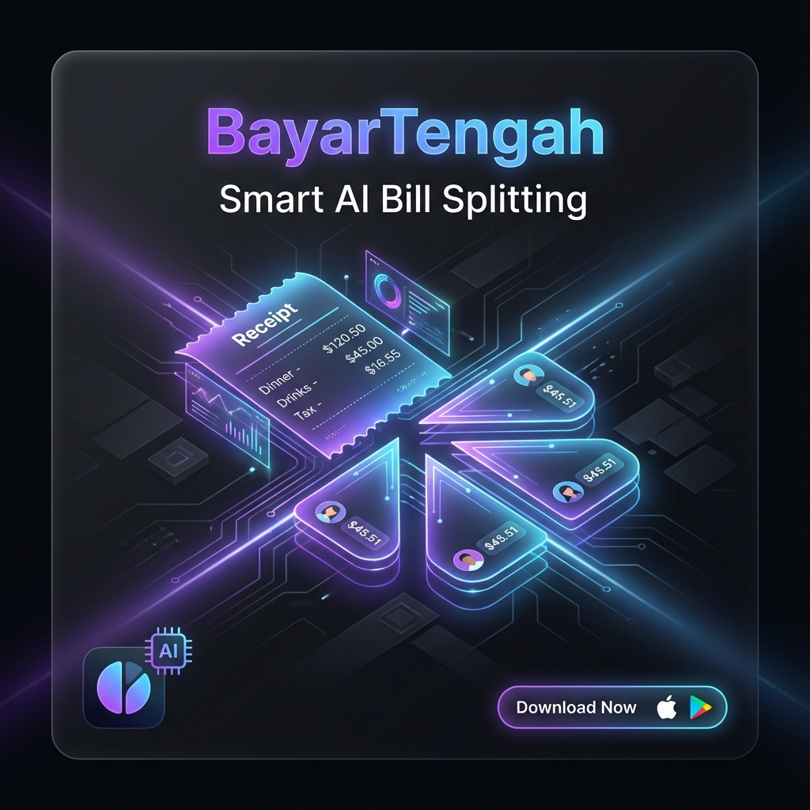
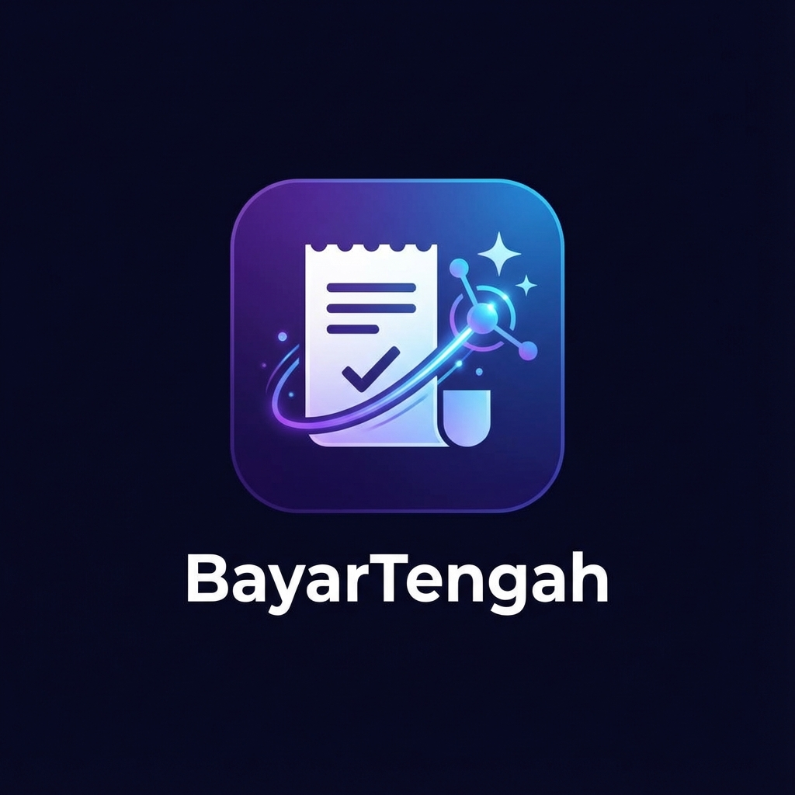
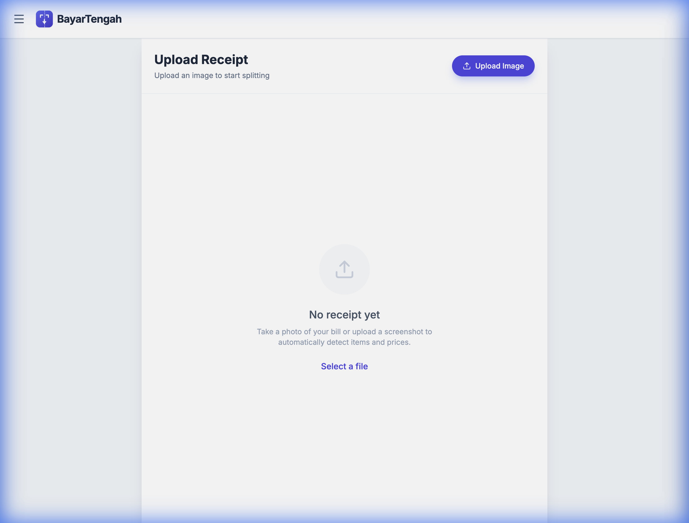
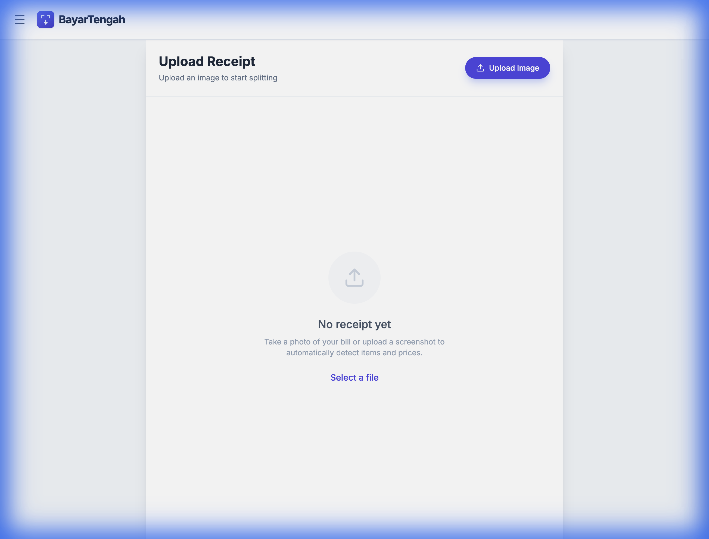
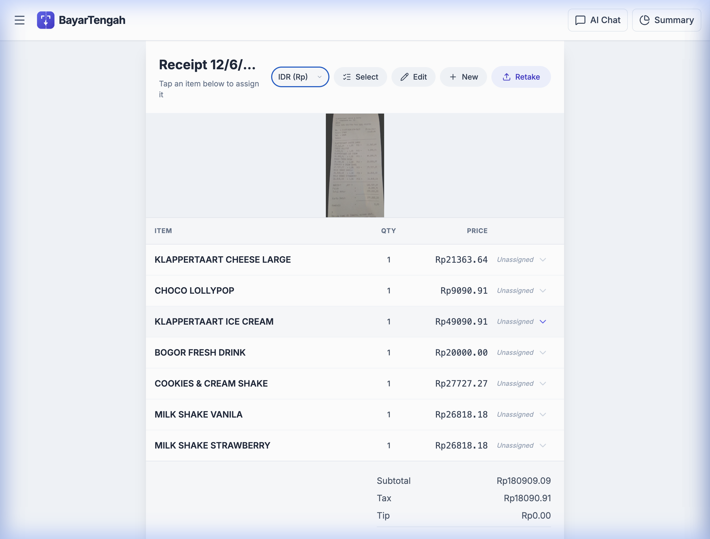
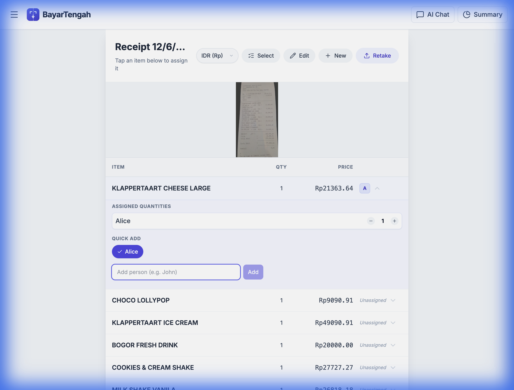
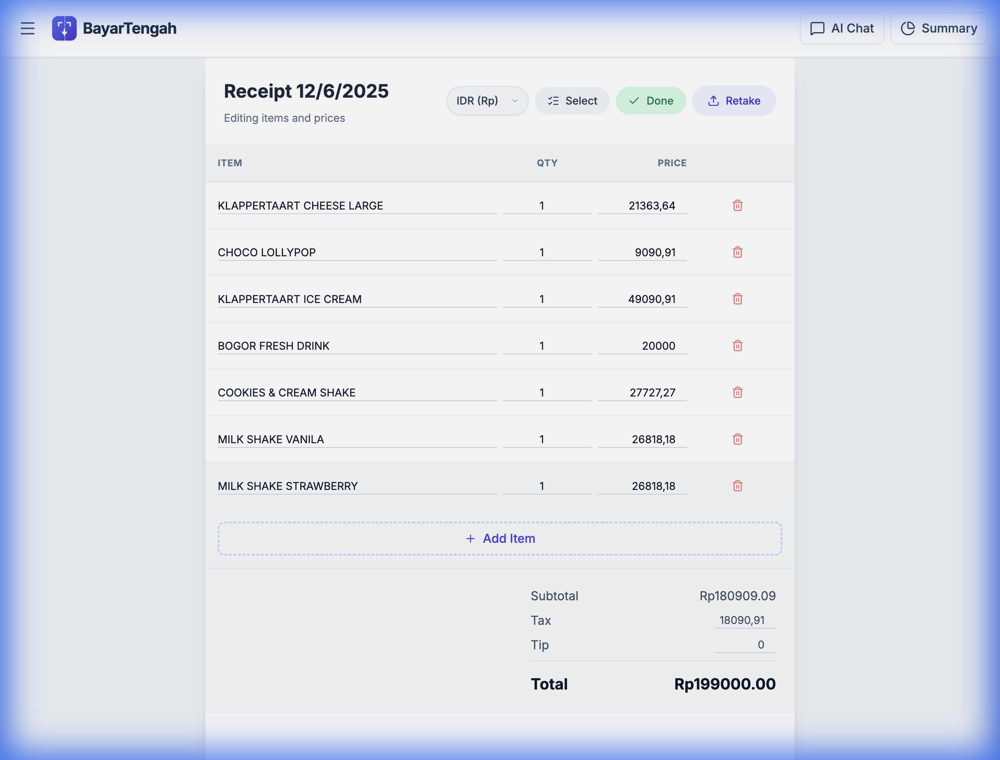
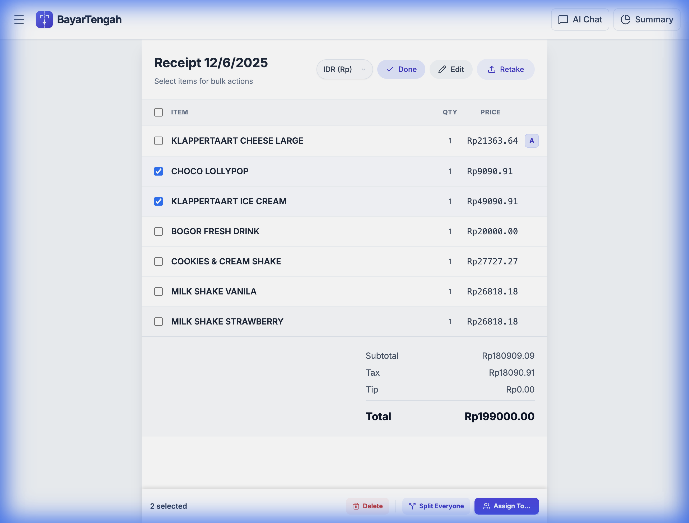
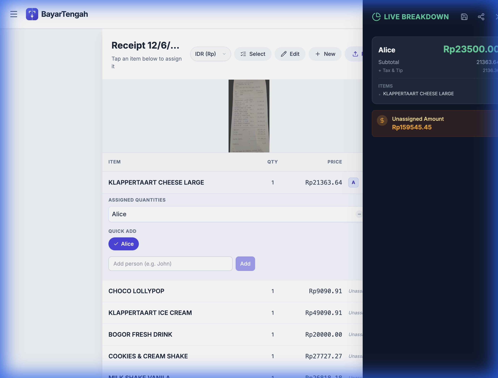

  

  # BayarTengah

  

## Smart, AI-Powered Bill Splitting for Groups & Trips

**BayarTengah** (Indonesian for "Split the Bill" or "Pay in the Middle") is an intelligent web application designed to simplify the often tedious process of sharing expenses. By leveraging Google's advanced Gemini AI, it transforms static receipt images into interactive, editable digital bills, making it easier than ever to calculate who owes what.

### Project Description

BayarTengah solves the "napkin math" problem at dinner tables and on vacations. It combines a clean, mobile-first interface with powerful backend AI to handle everything from simple dinner checks to complex multi-day trip expenses.

**How it works:**

1.  **Scan & Parse**: Upload a photo of any receipt. The app uses **Gemini 3 Pro** (Multimodal AI) to extract items, prices, quantities, tax, and tip with high accuracy.
2.  **Assign & Edit**:
    *   **Manual Control**: Tap items to assign them to friends. Use the "Edit Mode" to fix prices or split items unevenly (e.g., 2 people sharing 5 items).
    *   **AI Assistant**: Use the built-in chat to give natural commands like *"Tom had the burger and half the pizza"* or *"Split the appetizers between everyone except Sarah."*
3.  **Group & Summarize**:
    *   **Trips**: Create groups (e.g., "Bali Trip 2024") and organize multiple bills under one folder.
    *   **Aggregated Costs**: View a consolidated summary showing exactly how much each person owes across the entire trip.
4.  **Share**: Generate a clean text summary of the final split—including itemized breakdowns—ready to be copied and pasted into WhatsApp or other messaging apps.

**Technical Highlights:**
*   **Stack**: React 19, Tailwind CSS, Google GenAI SDK.
*   **Features**: Auto-save, Local Storage persistence, Multi-currency support (IDR, USD, etc.), and weighted quantity splitting.
*   **Privacy**: All data is stored locally in the user's browser.

## Screenshots

  <table border="0">
    <tr>
        <td>
            
<b>Landing Page</b>

            
        </td>
        <td>
            
<b>Upload Interface</b>

            
        </td>
    </tr>
  </table>

### Detailed Features

  <table border="0">
    <tr>
        <td>
            
<b>1. Receipt Analysis</b> AI parses items automatically

            
        </td>
        <td>
            
<b>2. Assign Items</b> Quickly assign to people

            
        </td>
        <td>
            
<b>3. Edit Mode</b> Fix prices or names easily

            
        </td>
    </tr>
    <tr>
        <td>
            
<b>4. Multi-Select</b> Group items for bulk actions

            
        </td>
        <td colspan="2">
            
<b>5. Summary</b> Live breakdown of debts

            
        </td>
    </tr>
  </table>

